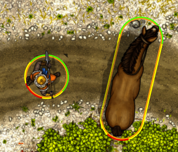
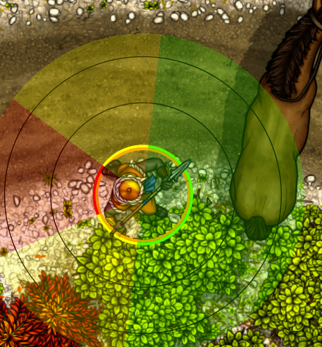
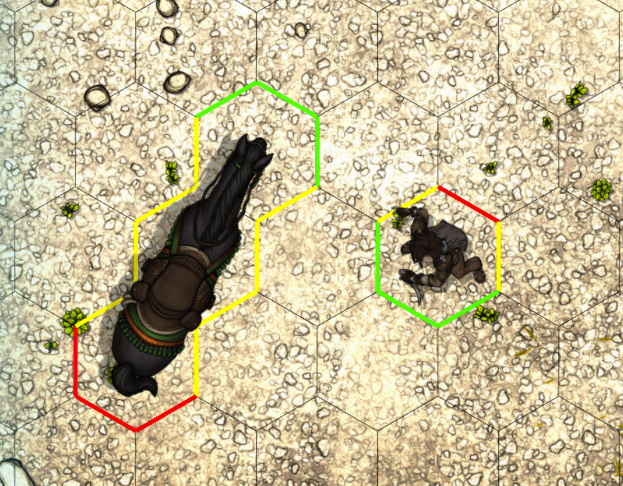
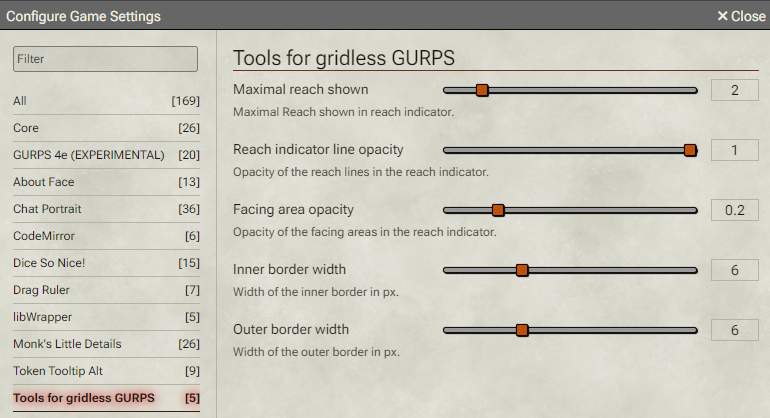
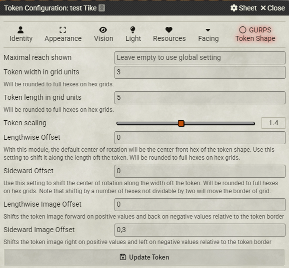

# GURPS Token Shape and Movement (with Tools for Gridless GURPS)

This module enable GURPS compatible shapes and movment for larger (multi hex) tokens and adds some Tools for gridless play to the GURPS Game Aid System. It was formerly named "Tools for Gridless GURPS" but the functionalty expanded to hex shapes an movemnt on hex grid maps:

1. **Token Facing Borders** – Replaces the default token border (shown on selection or mouse hover) with a border that indicates facing. There is a setting to always show the border on all tokens. 

   

2. **Reach and Facing Indicators** – Displays indicators for reach and front, side, and back angles when a key is pressed (Default: `I` for the current token, `Shift + I` for all tokens). You can change key bindings under "Configure Controls" in Foundry. (Default changed from `R` and `Shift + R` on Version 0.11.0 to avoid conflicts with core kex bindings. Teh change will not affect existing installations.)

   

3. **Support for Non-Square and Multi-Sized Tokens** – Ensures proper GURPS movement for all token sizes, centering movement on the head of the creature while the body follows. See the token setup section for details.

4. **Hex Grid Support** – Draws hex borders on hex grids and enables correct GURPS movement (Version 0.7.0). To implement this, custom token settings override some Foundry defaults, affecting all tokens across all scenes. This feature must be explicitly enabled in the module settings. **It is crucial to disable this setting before uninstalling the module** to prevent token configuration issues. If problems arise, reinstall the module and disable the setting before removal. **The About Face module (version 3.26.5 or higher) is required for correct movement on hex maps.**

5. **Toggle Movement On Rotation** – Toggle the automatic rotation on token movements on and off per user, great for retreats. To toggle use a button on the left toolbar in the token contriols or a hotkey (Default: `V`).

   

The Module requires the GURPS Game Aid System and the About Face Module (at least version 3.26.5).
For background information on how this works, see *[here](background.md)*.

## Limitations

1. **Hex Grid Reach Indicator** – The reach indicator currently functions the same on hex maps as on gridless maps. Facing colors may not always align perfectly with hex grid facings, and the reach shown will not be hex-shaped. A proper hex reach indicator is planned for a future version, but it is a complex feature. Since reach indicators are less critical on hex grids than in gridless play, this limitation is not considered major.

2.  **Locked Rotation Tokens** – Some limitations exist for tokens with locked rotation. See the token setup section for details.

3. **Incompatible with the Z-Scatter module** - and propably with any other moudule that modifies the token positioning.

### Tips for gridless play
In the Foundry scene set the Grid Type to gridless, the Grid Scale to 1, the Grid Unit to Yd and the Grid Size to the number of pixel for 1 yard.
Note that most maps for foundry are made with an unrealistic large scale to allow play with the 5 feet grid of DnD. That is in most cases unnecessary for GURPS gridless play. 
I usually set the number of pixels given for one DnD 5 feet square for 1 yard and get a realistic scale. Individual maps may require adjustments.

## Configuration



### Token Configuration



### **With the 'Enable GURPS Token Shapes and Movement on Hex Grids' Setting Enabled (Recommended)**

- Token shape and scaling settings move to the *GURPS Gridless* tab.
- Set token **width, length, and scaling**. On hex maps, these values are rounded to full hexes.
  - **Even-numbered widths produce asymmetrical tokens.** Use odd numbers for symmetrical tokens.
  - On gridless maps, exact values are used as entered.
- **Center of rotation/movement** defaults to the center front hex for multi-hex creatures (0.5 yards from the front on gridless maps).
  - Modify this using **Lengthwise Offset** (shifts forward/back) and **Sideward Offset** (shifts left/right, but should usually remain at 0).

##### Notes on portrait style tokens

With portrait style tokens, it is usually not desirable to let the token image rotate. To archive that, you can set _Lock Rotation_ on the _Identity: tab. 

That works without problems for 1 hex creatures.

For bigger creatures there are some limitations: The center of the image will be on the center of rotation. By default, this is in the front of the crature with this module. That will look odd in some situations. 
You can move the center of rotation back to the center of rotation unsing the _Lengthwise Offset_, but in many cases that would be against the GURPS movement rules.

With elongated token sizes, it will be even more problematic, because the border will rotate out of allingment with the image.
For elogated tokens, I recommend not locking rotation, even for portrait style tokens.

#### **With the _Enable GURPS tokens shapes and movement on Hex-Grids_ disabled (legacy)**

- If you use **portrait style tokens** just set the dimension of the Token on the Appearance tab and "Look rotation" on the Identity tab. Note that this will give somtimes odd results for elongated tokens.

- For rotating **top down style tokens** set the dimension of the Token on the Appearance tab. 
  If the token image has the same aspect ratio as the token, use the Image Fit Mode "Contain".  
  If the token image is square, use the image fit mode "Full Height" for long tokens and "Full Width" for wide tokens.
  I don't think any different aspect ratio will work.

- For multi hex tokens adjust the Anchor settings to move center of rotation to the head of the creature, if nessesary.
  To move the the center of rotation to center of the first hex of a token of lenght X (in hexes), set the Anchor Y to <br/>1 - 0.5 / x

- If you have to scale your token image, this will be interfer with the translation, because the anchor is used as the center of scaling. In this case, the formular will become <br/>(0.5 - 0.5 / x) / scale + 0.5

**Examples**:

One hex creatures like humans: Width: 1, Height: 1, Anchor X: 0.5, Anchor Y: 0.5, Image Fit Mode: Contain.

Long two hex creature like a lion: Width: 1, Height: 2, Anchor X: 0.5, Anchor Y: 0.75, If using a square image, Image Fit Mode: Full Height. 

Broad two hex creature like an large humanoid: Width: 2,  Height: 1, Anchor X: 0.5, Anchor Y: 0.5, If using a square image, Image Fit Mode: Full Width. 

Long tree hex creatures like an horse: Width: 1, Height: 3, Anchor X: 0.5, Anchor Y: 0.83, If using a square image, Image Fit Mode: Full Height.

Long 2 x 3 hex creature: Width: 2, Height: 3, Anchor X: 0.5, Anchor Y: 0.83, If using a square image, Image Fit Mode: Full Height.

Long three hex creatures with an image scaling of 1.5: Width: 1, Height: 3, Anchor X: 0.5, Anchor Y: 0.72, If using a square image, Image Fit Mode: Full Height.

### API

If you want to set the token dimenions, scale and offset from a macro or from another module, youn need to set them through this module if it is active. Changes to the normal token attributes will have no effect, because they will be  overwriten by the module.

You can get the api with this call:

const gurpsGridlessApi = game.modules.get('gurps-gridless')?.api;

The api has the following functions:

async function setTokenDimensions(tokenDokument, length, width)

async function setTokenOffsetX(tokenDokument, offset) 

async function setTokenOffsetY(tokenDokument, offset)

async function setTokenScale(tokenDokument, scale) 

async function setTokenImageOffsetX(tokenDokument, offset) 

async function setTokenImageOffsetY(tokenDokument, offset) 

If you are doing a module and need to accses the api during startup, you can do so savely in the hook 'gurpsGridlessReady'. For convinience, the api is given as the hook argument:

```
// if I need to do something as soon as the gurps-gridless is ready
Hooks.on('gurpsGridlessReady', (api) => {
  // do what I need with the api
});
```

Excample macro to set an alternat image and adjust token size and scaling:

```
tokens = canvas.tokens.controlled;

if (tokens.length > 0){
	tokens.forEach(layDown);
} else {
	ui.notifications.warn("No Tokens were selected");
}

async function layDown(token){

updates = [{_id: token.id, texture: {src: 'tokens/FAsync/FA_Tokens_Webp/NPCs/Townsfolk_03/Desert_Guard_Corpse_Orange_A_1x2.webp'}}];

canvas.scene.updateEmbeddedDocuments("Token",updates);

await game.modules.get('gurps-gridless').api.setTokenScale(token.document,1.4);
}

await game.modules.get('gurps-gridless').api.setTokenDimensions(token.document,2,1);
```

### Legal

The material presented here is my original creation, intended for use with the [GURPS](http://www.sjgames.com/gurps) system from [Steve Jackson Games](ttp://www.sjgames.com). This material is not official and is not endorsed by Steve Jackson Games.

[GURPS](http://www.sjgames.com/gurps) is a trademark of Steve Jackson Games, and its rules and art are copyrighted by Steve Jackson Games. All rights are reserved by Steve Jackson Games. This tool is the original creation of Stefan Leng and is released for free distributionunder the permissions granted in the [Steve Jackson Games Online Policy](http://www.sjgames.com/general/online_policy.html)

## Installation

This module can be installed via the Foundry Package Manager.

To install manually, use this Manifest URL:
```plaintext
https://github.com/StefanLeng/gurps-gridless/releases/latest/download/module.json
```

---

## Development

### Prerequisites
- Install `node` and `npm` (or `yarn`, though only `npm` is officially supported).
- Recommended: Latest **LTS** version of `node`.
- Install dependencies:
  ```bash
  npm install
  ```

### Building
```bash
npm run build  # Build manually
npm run build:watch  # Watch for changes and auto-build
```

### Linking to Foundry VTT
- Create `foundryconfig.json`:
```json
{
  "dataPath": ["/absolute/path/to/your/FoundryVTT"]
}
```
- Run:
  ```bash
  npm run link-project
  ```