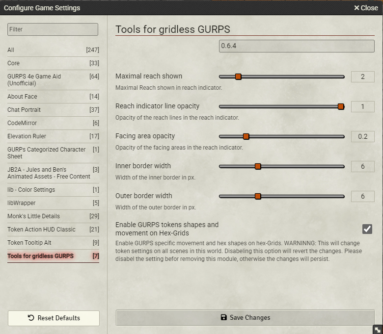

# gurps-gridless

This Module adds some Tools for gridless play to the GURPS Game Aid System. :

1. Replaces the border shown on the selected token and on mouse hover on a token with a border indicating facing.


2. Displays an indicator for reach and front, side, back angles on a key press (Default: R for the current token, shift + R for all tokens). 
You can change the key binds under "configure Controls" in Foundry.


3. Support for non square tokens and all token sizes with proper Gurps movement (centerd on the head of the creature with the body following). See below how to set up the token. 

The module can also be used to get this movement on hex grids, but it will only work properly on "Hexagonal Columns - even".

With version 0.6 for Foundry 12 I had to remove the following features 

1. _Shift the center of rotation_. With Foundry 12 the center of rotation can nativly shifted with the Anchor X and Y settings on the appearace tab. 

2. _fixing Foundry scaling for token images that the token image scales with the longest token dimension_. This is not longer possible and not desirable anyway. 
Foundry 12 will scale the image to fit into the token dimension, accouding to the Immage Fit Mode you select on the Apeareance tab. If your token image has the same aspect ratio as the token, any of ten modes will work. If your image is square (common for token art meant for D&D) you have to chose Full Width or Full Height corresponding to the larger demension of the token.

3. _Rotate token art to face in the correct direction (downward) inside the token border_. This is not longer possible with Foundry 12 in some situations. It was quite hacky anyway. Use downward facing Token images as recomendet by Foundry. if nessesary use an image editing programm to rotate the images beforhand.      

Configuration:



Token configuration:


The Module requires the GURPS Game Aid System and the About Face Module.

### Tips for gridless play
In the Foundry scene set the Grid Type to gridless, the Grid Scale to 1, the Grid Unit to Yd and the Grid Size to the number of pixel for 1 yard.
Note that most maps for foundry are made with an unrealistic large scale to allow play with the 5 feet grid of DnD. That is in most cases unnecessary for GURPS gridless play. 
I usually set the number of pixels given for one DnD 5 feet square for 1 yard and get a realistic scale. Individual maps may require adjustments.

### Configuration of tokens
If you use portrait style tokens just set the dimension of the Token on the Appearance tab and "Look rotation" on the Identity tab.

For rotating top down style tokens set the dimension of the Token on the Appearance tab. 
If the token image has the same aspect ratio as the token, use the Image Fit Mode "Contain".
If the token image is square, use the image fit mode "Full Height" for long tokens and "Full Width" for wide tokens.
I don't think any differnt aspect ratio will work.

For multi hex tokens adjust the Anchor settings to move center of rotation to the head of the creature, if nessesary.
To move the the center of rotation to center of the first hex of a token of lenght X (in hexes), set the Anchor Y to 1 - 0.5 / x

If you have to scale your token image, this will be interfer with the transaltion, because the anchor is used as the center of scaling. In this case, the formular will become (1 - 0.5 / x) / scale + 0.5

Examples:

One hex creatures like humans: Width: 1, Height: 1, Anchor X: 0.5, Anchor Y: 0.5, Image Fit Mode: Contain.

Long two hex creature like a lion: Width: 1, Height: 2, Anchor X: 0.5, Anchor Y: 0.75, If using a square image, Image Fit Mode: Full Height. 

Broad two hex creature like an large humanoid: Width: 2,  Height: 1, Anchor X: 0.5, Anchor Y: 0.5, If using a square image, Image Fit Mode: Full Width. 

Long tree hex creatures like an horse: Width: 1, Height: 3, Anchor X: 0.5, Anchor Y: 0.83, If using a square image, Image Fit Mode: Full Height.

Long 2 x 3 hex creature: Width: 2, Height: 3, Anchor X: 0.5, Anchor Y: 0.83, If using a square image, Image Fit Mode: Full Height.

Long tree hex creatures with an image scaling of 1.5: Width: 1, Height: 3, Anchor X: 0.5, Anchor Y: 0.72, If using a square image, Image Fit Mode: Full Height.

### Legal

The material presented here is my original creation, intended for use with the [GURPS](http://www.sjgames.com/gurps) system from [Steve Jackson Games](ttp://www.sjgames.com). This material is not official and is not endorsed by Steve Jackson Games.

[GURPS](http://www.sjgames.com/gurps) is a trademark of Steve Jackson Games, and its rules and art are copyrighted by Steve Jackson Games. All rights are reserved by Steve Jackson Games. This tool is the original creation of Stefan Leng and is released for free distributionunder the permissions granted in the [Steve Jackson Games Online Policy](http://www.sjgames.com/general/online_policy.html)


## Installation

This moduel can be installed via the Foundry Package Manager.
To install it manually, user thhis Manifest URL.
https://github.com/StefanLeng/gurps-gridless/releases/latest/download/module.json

## Development

### Prerequisites

In order to build this module, recent versions of `node` and `npm` are
required. Most likely, using `yarn` also works, but only `npm` is officially
supported. We recommend using the latest lts version of `node`. If you use `nvm`
to manage your `node` versions, you can simply run

```
nvm install
```

in the project's root directory.

You also need to install the project's dependencies. To do so, run

```
npm install
```

### Building

You can build the project by running

```
npm run build
```

Alternatively, you can run

```
npm run build:watch
```

to watch for changes and automatically build as necessary.

### Linking the built project to Foundry VTT

In order to provide a fluent development experience, it is recommended to link
the built module to your local Foundry VTT installation's data folder. In
order to do so, first add a file called `foundryconfig.json` to the project root
with the following content:

```
{
  "dataPath": ["/absolute/path/to/your/FoundryVTT"]
}
```

(if you are using Windows, make sure to use `\` as a path separator instead of
`/`)

Then run

```
npm run link-project
```

On Windows, creating symlinks requires administrator privileges, so
unfortunately you need to run the above command in an administrator terminal for
it to work.

You can also link to multiple data folders by specifying multiple paths in the
`dataPath` array.

### Creating a release

The workflow works basically the same as the workflow of the [League Basic JS Module Template], please follow the
instructions given there.

## Licensing

This project is being developed under the terms of the
[LIMITED LICENSE AGREEMENT FOR MODULE DEVELOPMENT] for Foundry Virtual Tabletop.

Please add your licensing information here. Add your chosen license as
`LICENSE` file to the project root and mention it here.  If you don't know which
license to choose, take a look at [Choose an open source license].

[League Basic JS Module Template]: https://github.com/League-of-Foundry-Developers/FoundryVTT-Module-Template
[LIMITED LICENSE AGREEMENT FOR MODULE DEVELOPMENT]: https://foundryvtt.com/article/license/
[Choose an open source license]: https://choosealicense.com/
